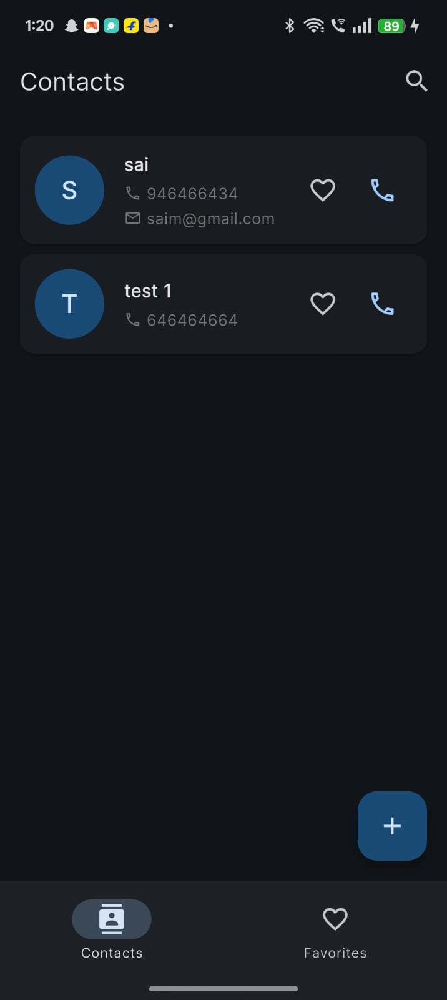
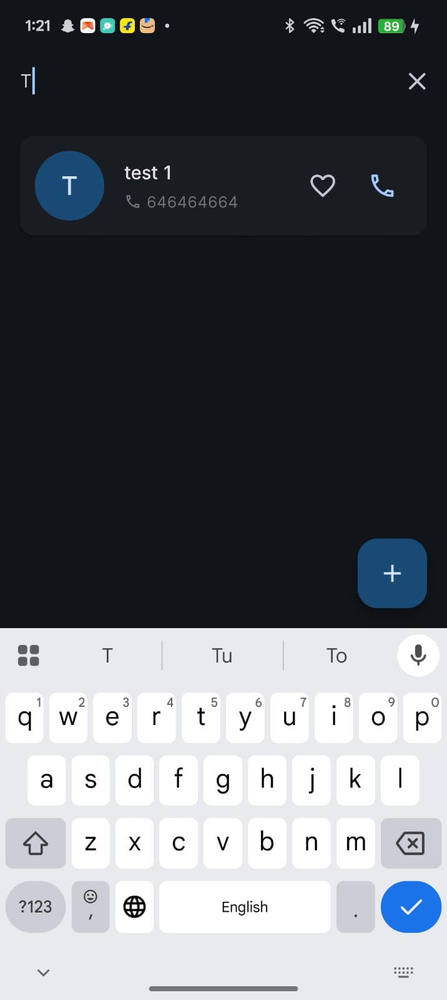

# 📇 Contacts App - Google Contacts Clone

A feature-rich Flutter contacts management application inspired by Google Contacts, built with Material Design 3 and SQLite for offline storage.


## 📱 About The App

This is a complete contacts management solution that allows users to store, manage, and communicate with their contacts efficiently. The app features a clean Material Design 3 interface, offline storage, and seamless calling integration.

---

## ✨ Features

### Core Functionality
| Feature | Description |
|---------|-------------|
| ✅ **View Contacts** | Display all contacts in a scrollable list |
| ✅ **Add Contact** | Create new contacts with name, phone, email, address, company, job title, birthday, and photo |
| ✅ **Edit Contact** | Update existing contact information |
| ✅ **Delete Contact** | Remove contacts with confirmation dialog |
| ✅ **Contact Profile** | View detailed contact information in a beautiful profile screen |
| ✅ **Call Integration** | Direct calling from the app with one tap |
| ✅ **Favorite System** | Mark/unmark contacts as favorites |
| ✅ **Favorites Tab** | Quick access to all favorite contacts |
| ✅ **Search** | Search contacts by name, phone number, or email |

### User Interface
- **Material Design 3** with light/dark theme support
- **Responsive layout** for all screen sizes (phones, tablets)
- **Smooth animations** and transitions
- **Bottom navigation** with Contacts and Favorites tabs
- **Intuitive contact cards** with quick action buttons

### Data Management
- **SQLite database** for offline-first storage
- **Automatic data persistence**
- **CRUD operations** with error handling
- **Contact metadata** (creation date, last updated)

---

## 📸 Screenshots

| Home Screen | Favorites Tab | Contact Details |
|:-----------:|:-------------:|:---------------:|
|  |  |  |

| Add Contact | Edit Contact | Search |
|:-----------:|:------------:|:------:|
|  |  |  |

---

## 🎥 Video Demo

[](https://drive.google.com/file/d/14k2OideNv5D7RUSmZ7dQC-uFBWaAf04M/view?usp=sharing)

Click the badge above or use this link:  
🔗 [Google Drive Video Demo](https://drive.google.com/file/d/14k2OideNv5D7RUSmZ7dQC-uFBWaAf04M/view?usp=sharing)

---

## 📲 Installation

### Method 1: Download APK (Recommended)
1. Download the latest APK from the [Releases Page](https://github.com/saieee1/Contact_app1/releases/tag/v1.0.0)
2. Open the APK file on your Android device
3. Allow installation from unknown sources if prompted
4. Open the app and grant necessary permissions

**Direct APK Link:**  
📦 [Download app-release.apk](https://github.com/saieee1/Contact_app1/releases/download/v1.0.0/app-release.apk)

### Method 2: Build from Source
```bash
# Clone the repository
git clone https://github.com/saieee1/Contact_app1.git

# Navigate to project directory
cd Contact_app1

# Get dependencies
flutter pub get

# Run the app
flutter run

# Build APK
flutter build apk --release